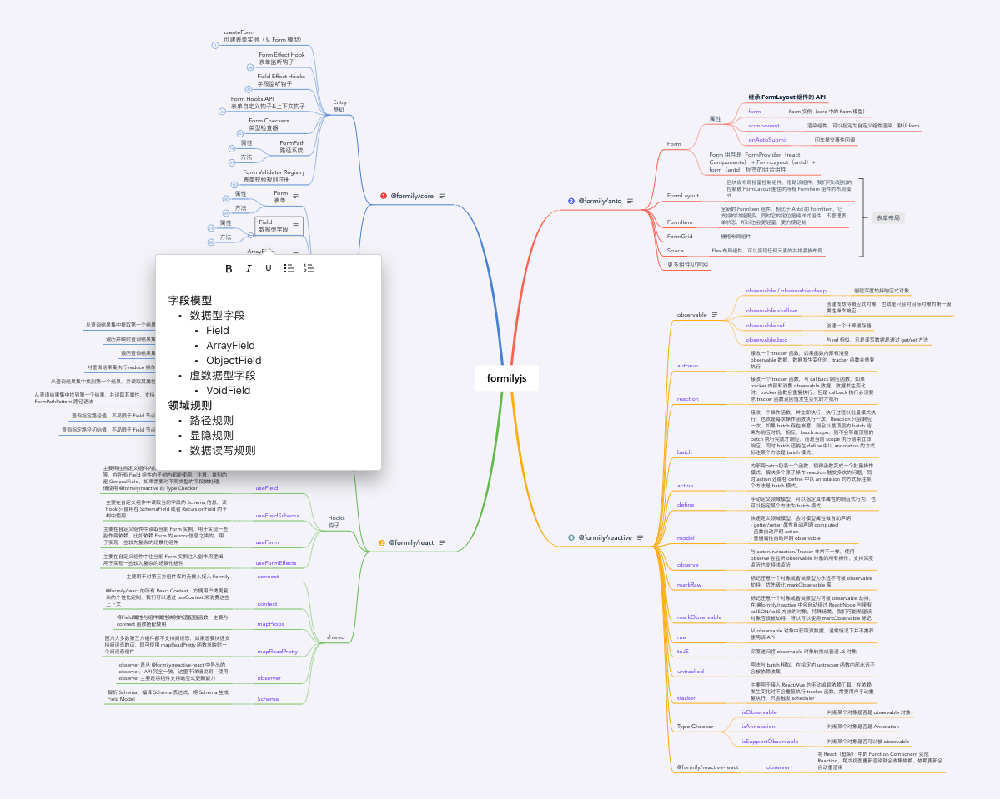
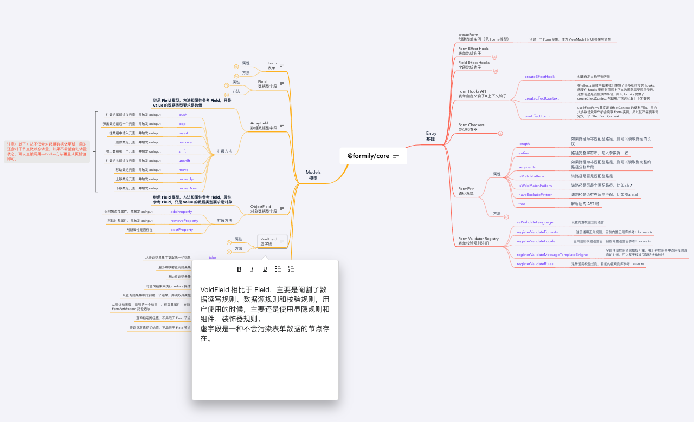
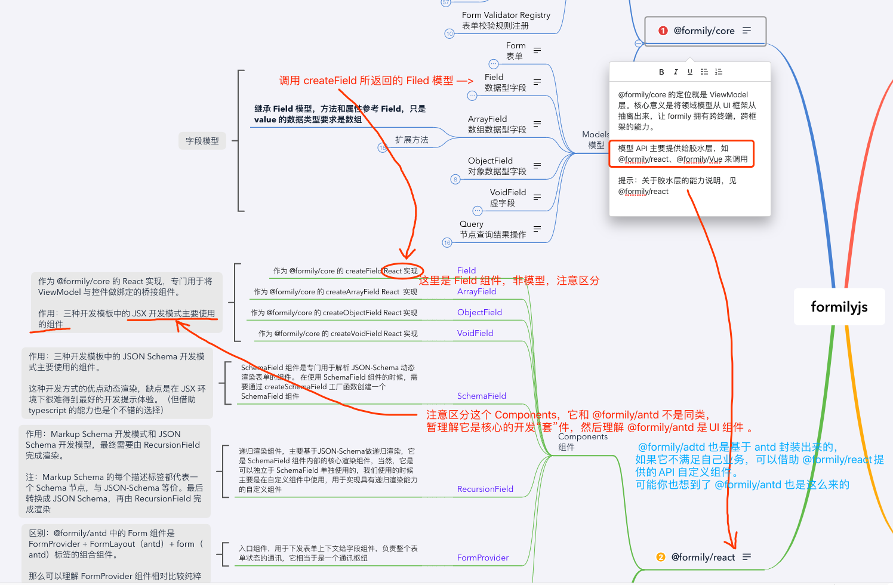

> 更新: 2022-06-27

# v2.formilyjs-xmind
因为 Formily 的学习成本还是比较高的，思维导图能够帮助初学者快速了解 Formily 的全貌。想要深入了解及使用，最重要的还是看官方文档。不得不说，formily 内容的确很多，但是只要对全貌有概念了，开发起来就像开了挂一样的高效。

### 入门学习路线：
1. @formily/core，了解 Formily 的核心，里面的 API 用来操控整个表单、字段数据；
2. @formily/antd、@formily/vant 等，可选的，这些都是开箱即用的组件库，它和普通 antd 有什么不同？其实你用普通 antd 组件，然后绑定事件，受控再去调用 @formily/core 的 API 也是可以收集表单值，做校验什么的，但你发现了吗，这种重复的工作，为什么不做一层封装，@formily/antd 就是做了这件事；
3. @formily/react 或 @formily/vue，可选的，到这步你可能要根据业务自定义组件了，正好用它提供的 Hook 等 API 能非常方便的实现你想要的，这类 API 看文档有点难懂？建议直接参考第 2 步提到开箱即用组件库的源码，全是例子，举一反三更容易掌握；
4. @formily/reactive，可选的，进阶了解 Formily 内核，响应式编程。

### fomily 的思维导图总览

#### @formily/core

#### @formily/react

#### 最后来一张大白话的简单理解

### 最后
图文件会持续同步官网 API 并更新，并加以个人理解，有错误的地方还请指出交流，感谢！
